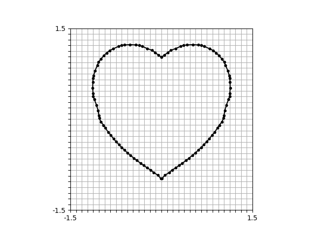

# NOODLES
## Dual marching squares in Rust

Based on the description in _Wenger, Rephael. Isosurfaces: geometry, topology, and algorithms. CRC press, 2013._



## Run examples

Segmenting a rust function

```
cargo run --example heart
```

Segmenting a string expression

```
cargo run --example formula
```

The results will be in the working directory in form of .obj files

## Python

**You need to be in a virtual environment and install**

```
python -m venv .venv
. .venv/bin/activate
pip install -r requirements.txt
```

Switch to python folder, build python package and run example
```
cd noodles-py
maturin develop --release
python main.py
```

## Known issues

It is not possible currently to segment a curve that touches the boundary cells in the background mesh. In this case, the algorithm will simply fail.
